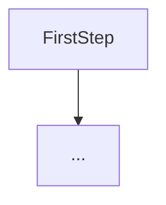

# Linear Regression (single variable)

Model
$$f_{w,b}(x^{(i)}) = wx^{(i)} + b \tag{1}$$

-   $i$: The $i_{th}$ training example
-   $w$: Model parameter
-   $b$: Model parameter

# Cost Function

The cost function is used to evaluate the performance of the model. The goal is to find model parameters where the cost function value is as small as possible.
$$J(w,b) = \frac{1}{2m} \sum\limits_{i = 0}^{m-1} (f_{w,b}(x^{(i)}) - y^{(i)})^2 \tag{2}$$

To find the parameter values which yield the lowest cost function, we gradient descent.

# Gradient Descent

It's used to automate the process of optimizing $w$ and $b$.

By

$$
\begin{align*}
\;  w &= w -  \alpha \frac{\partial J(w,b)}{\partial w} \tag{3}  \; \newline
 b &= b -  \alpha \frac{\partial J(w,b)}{\partial b}
\end{align*}
$$

-   $\frac{\partial J(w,b)}{\partial w}$: The gradient
-   $a$: The learning rate

The gradient is defined as the cost given values for the parameters $w$ and $b$.

$$
\begin{align}
\frac{\partial J(w,b)}{\partial w}  &= \frac{1}{m} \sum\limits_{i = 0}^{m-1} (f_{w,b}(x^{(i)}) - y^{(i)})x^{(i)} \tag{4}\\
  \frac{\partial J(w,b)}{\partial b}  &= \frac{1}{m} \sum\limits_{i = 0}^{m-1} (f_{w,b}(x^{(i)}) - y^{(i)}) \tag{5}\\
\end{align}
$$

